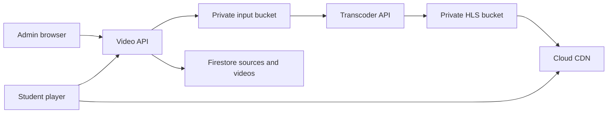

# Secure lesson video architecture

The lesson-resource modal stores a typed `LessonResource` and links every video to a canonical `sources` record. Original bytes are uploaded once through a GCS resumable session; the Express API only receives metadata and completion signals.

The player obtains a short playback session from the API, then Shaka requests adaptive HLS through Cloud CDN with a path-scoped signed cookie. Plyr supplies the controls. The original object is never exposed through `getDownloadURL()` and the client never contains a signing key.

The video subsystem is disabled independently with `ENABLE_VIDEO`. Transcoding and CDN delivery remain gated by their own environment configuration so a source upload cannot be accidentally presented as a public MP4.
